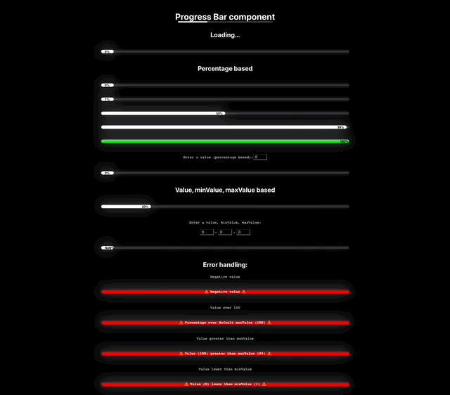
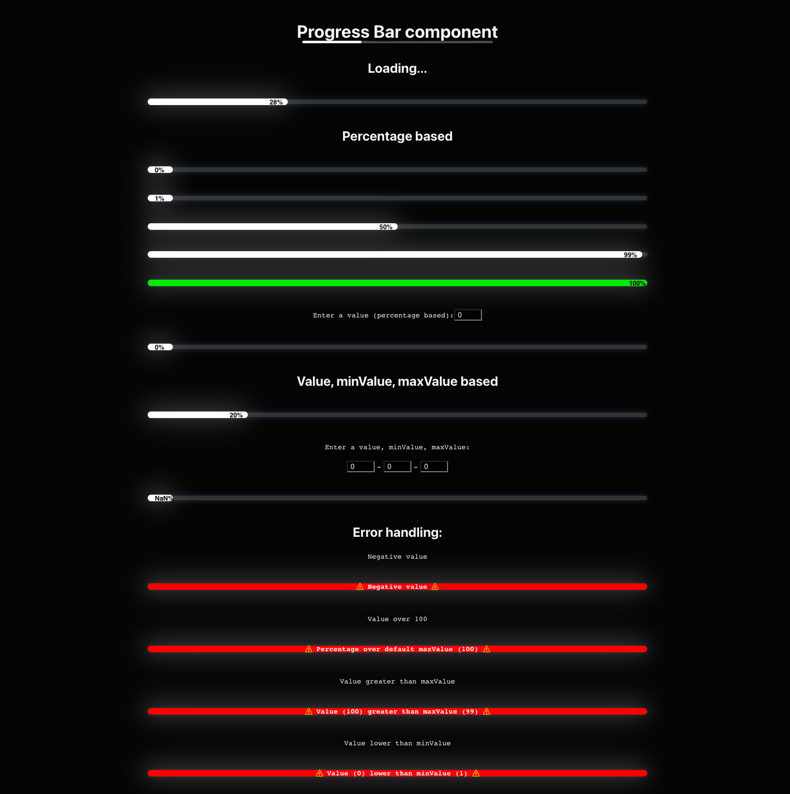
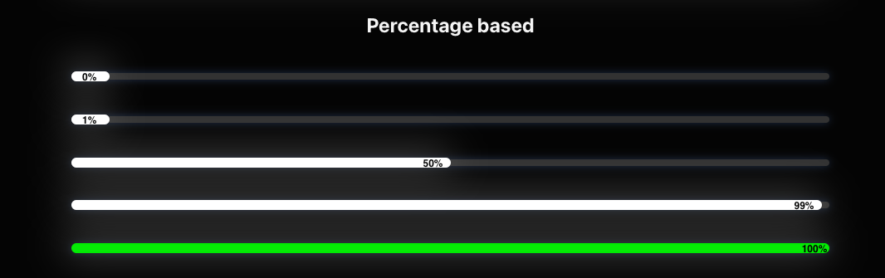
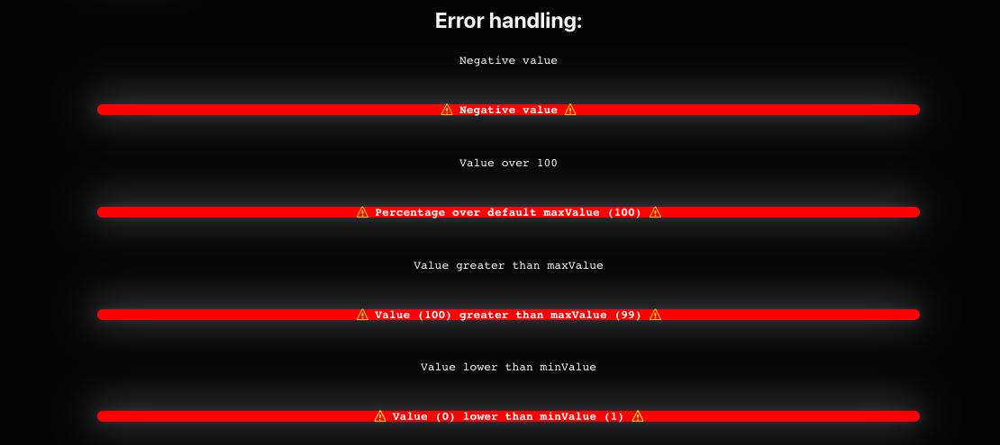

<div align="center" style="background:black;">
  
</div>

# Progress Bar

Progress Bar reusable component made with React. <br /><br />

Many bigger projects try to reuse the same set of components over and over again.
This allows the development team to implement new features faster because it can rely on
existing code. It also helps the users, because once they get used to a certain component,
they can recognize it and immediately know how to use it. <br /><br />

Reusable components often try to be very solid and able to deal with
any set of props, without falling appart. That's why error handling is a big part of this
component.

## Technologies

This project was bootstrapped with [Create React App](https://github.com/facebook/create-react-app).

## Setup

First of all clone the repo on your own machine

```bash
git clone https://github.com/lmguerrini/progress-bar-component.git
```

Install all the dependencies required

```bash
npm install
```

Start the server

```bash
npm start
```

Now you should be ready to see the Progress Bar component running at http://localhost:8080

## Main features

-   **Percentages**: it is possible to provide any percentage number to this component and see a corresponding output - as well as the extremes, being 0% or 100%
-   **Absolute values**: the component is also able to handle absolute values and calculate the percentage based on these values
-   **Error handling**: handling the possibility the user provides a negative percentage / less than the specified minimum value or a percentage that is above 100 / greater than the specified maximum value
    <br />

## Preview

### Home

 &emsp;


### Loading


### Percentage based

 &emsp;


### Absolute values based

 &emsp;


### Error handling



---

[**Back to Progress Bar**](#progress-bar)
